# *The Economist's* Ukraine war-fire model
This repository contains the source code and data associated with *The Economist’s* Ukraine war-fire model. This model uses statistical techniques from machine learning and publicly available satellite data on temperature anomalies to detect war events. Between February 24th, 2022, and February 18th, 2023, we detected 14,068 such events in the country. We have since added many more. 

See the latest data, updating several times daily, here: [Tracking the Ukraine war: where is the latest fighting?](https://www.economist.com/interactive/graphic-detail/ukraine-fires) 

If you have any ideas for how we might improve this work or the presentation of it, email [sondresolstad@economist.com](mailto:sondresolstad@economist.com) or message [@Sondreus](https://twitter.com/Sondreus). If you find this data useful, a few lines on how are also gratefully received via the same channels. 

In the following maps, red indicates that fires are classified as war-related. Size reflects approximate population density. This data is not perfect - see section on limitations below. 

### Events in the past week
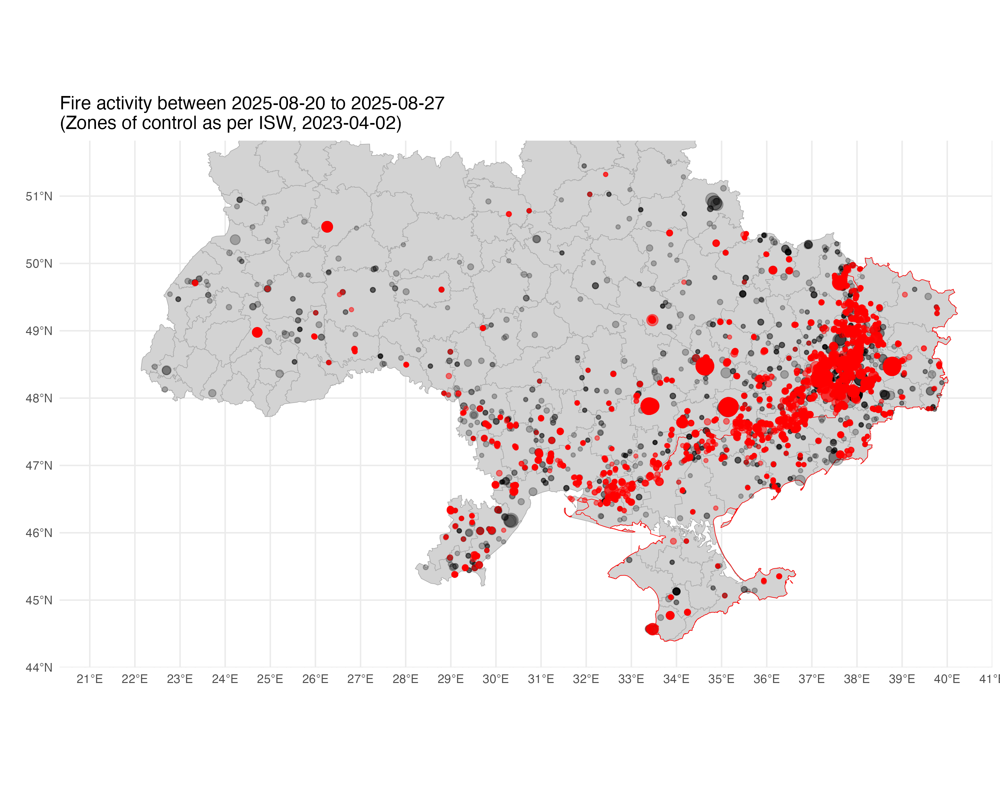  

### Events since Feb 24th, 2022
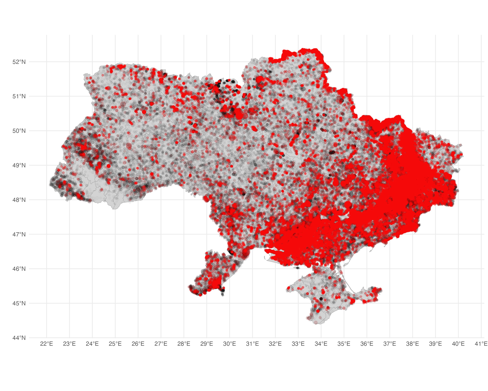  

### Events day-by-day, since Feb 24th, 2022

### Spotlight: Donetsk
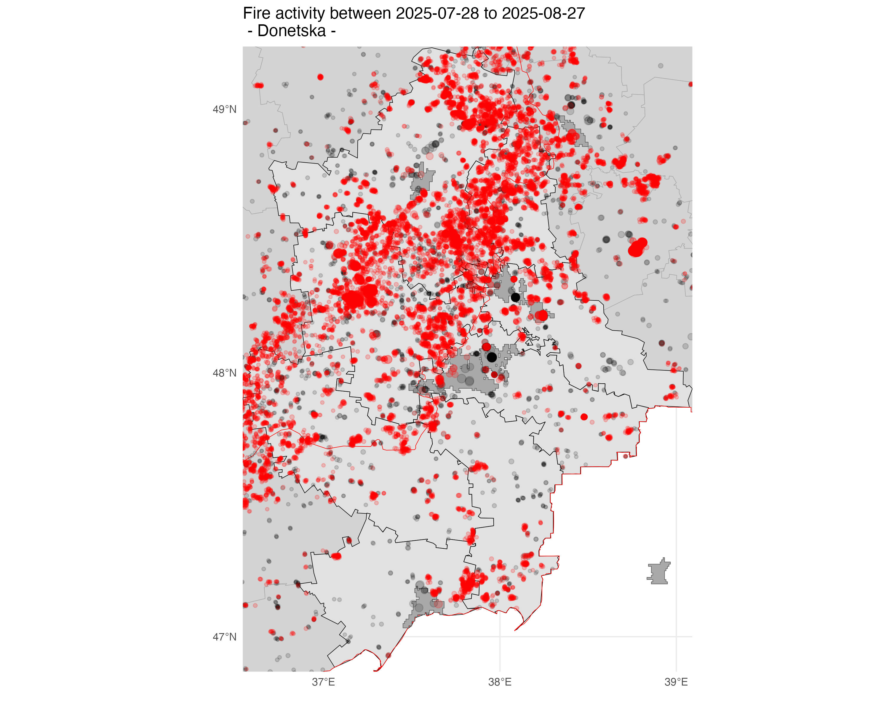  
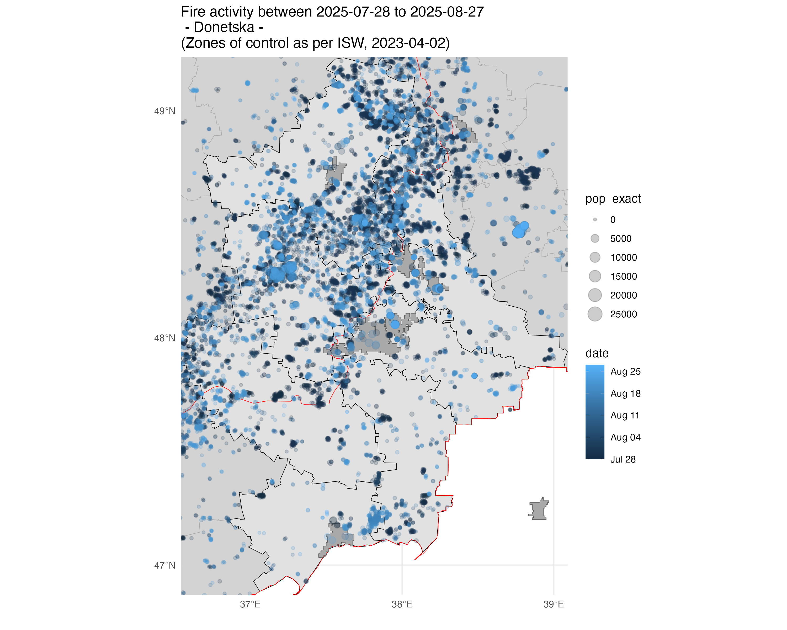  

### Spotlight: Bakhmut
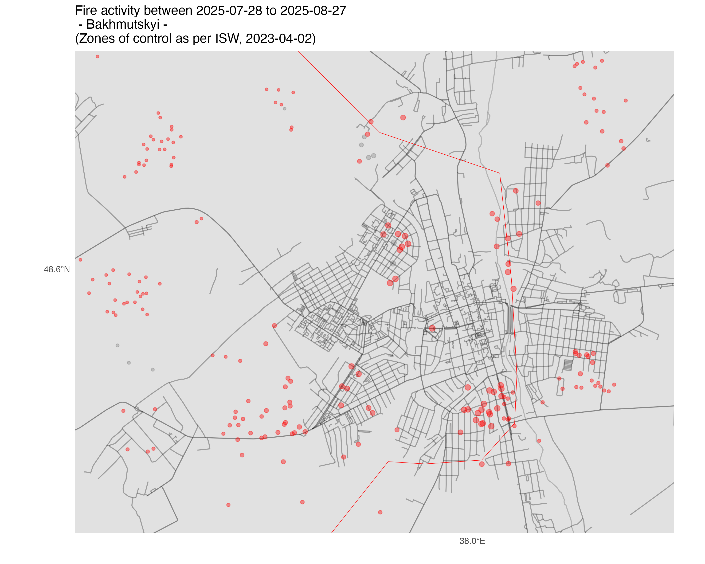  
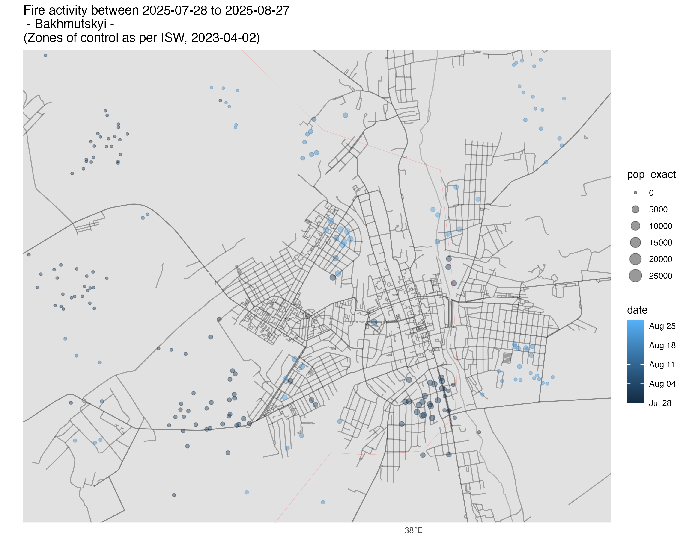  
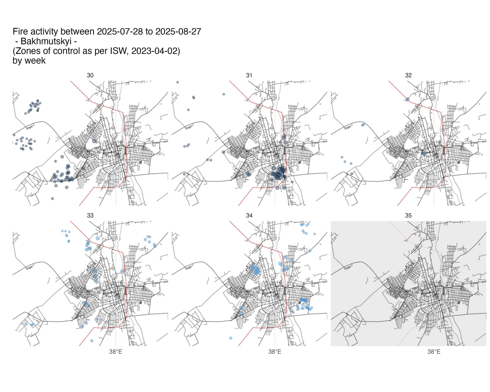  
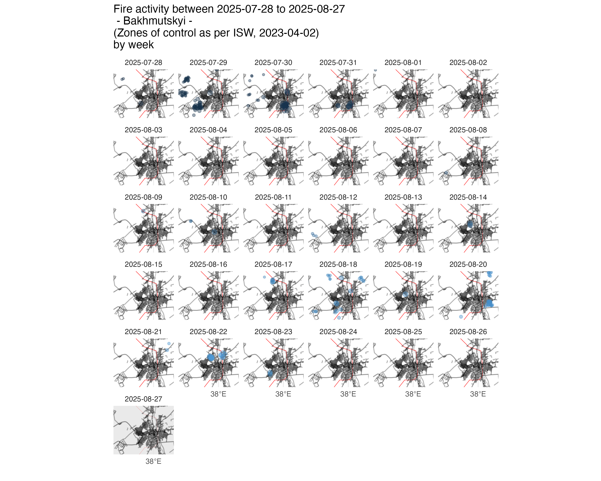  

### Events in the past month
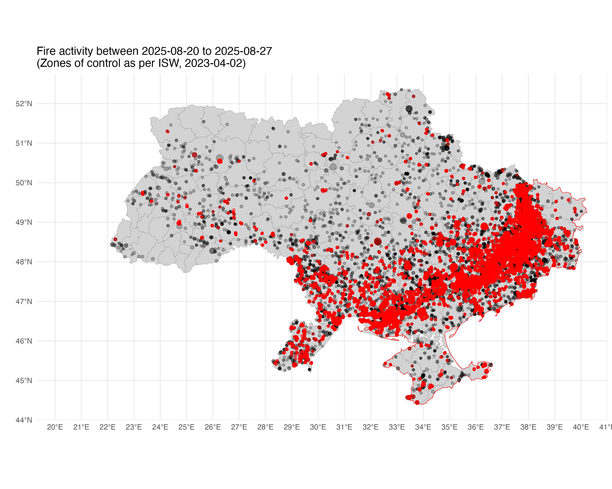  

### Events in the past week
  

### Charts of events per day
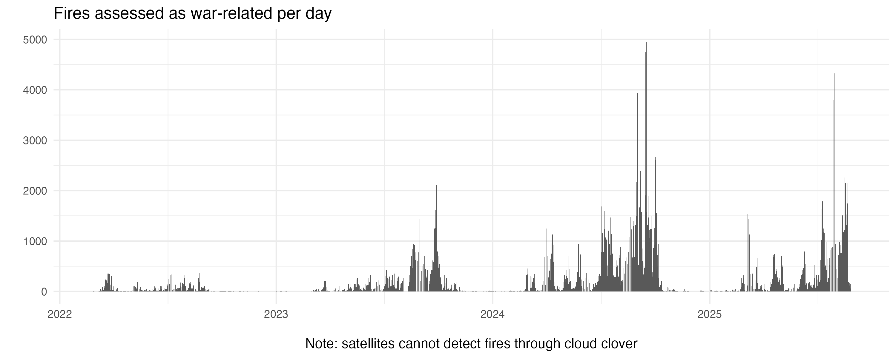  
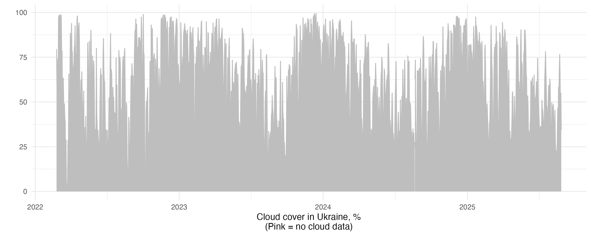  
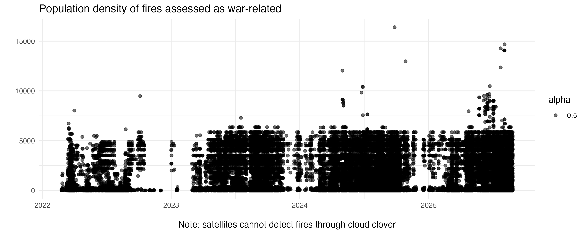  
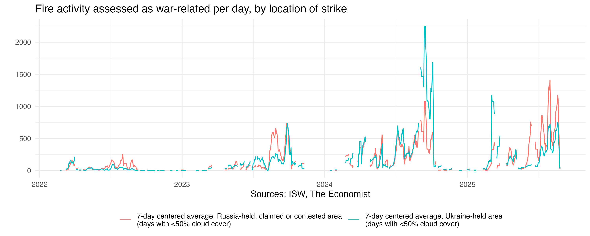  

## Scripts, sources and output data
Generating the model ensemble, as well as model outputs, maps, and analysis charts can be done by running the master script: 

* [`scripts/00-master-script.R`](scripts/00-master-script.R)

This script calls component scripts as well as auxiliary scripts. These produce, among other things, the following map, where each of the 14,068 dots is a fire event with a precise location (in most cases, to within 500m accuracy), a date, and a time of day.

  

To update the model, run:
* [`scripts/000-autoupdater.R`](scripts/000-autoupdater.R)

This automatically downloads the latest data, updates predictions, get exact population densities of events, runs the classifier to detect war activity, and updates all maps, charts, and animations.

## Classification of events

All details on the procedure used to classify events are available in the above scripts. In brief, events are classified as war-related if they met the following thresholds:
* Excess fire activity in a given 0.1 latitude by 0.1 longitude area of Ukraine on a given day is so large as to have less than 5% probability of occuring in a normal year.
* Such excess is substantial: it has happened regularly in that area of the country, defined as twice within a single cell less than 50km away, at least 7 days apart and less than 180 days apart (i.e. two spaced-out events within a six-month period).
* or: A fire event takes place in a cell less than 10 days after it has meet the above two requirements. (In other words, other activity producing fire events, typically from agriculture, does not resume until 10 days after an area has seen a war event.)

## Limitations
Many war events do not produce heat at a level detectable by the satellite systems we use, and even if they do, events may go unrecorded because they happen under cloud cover, which regularly obscures much of the country from such satellite monitoring, or have cooled by the time the satellites pass overhead. This means not all war events are detected. 

Moreover, our statistical method classifying events as war-related (or not war-related) is probabilistic. This means that it will sometimes categorise events which were unrelated to the war as war-related, and more frequently, given our strict thresholds, classify events related to the fighting as insufficiently abnormal to be labelled war-related.

Finally, we cannot currently produce accurate classifications of war-related events during periods of extreme heat (defined as when average temperatures are higher than the upper end of the 95% confidence interval of temperatures in Ukraine). During such periods (so far, only once, from April 4th to April 11th, 2023), no events are classified as war-related.  

## Variables in main exports
The files [`output-data/ukraine_fires.csv`](output-data/ukraine_fires.csv) and [`output-data/ukraine_war_fires.csv`](output-data/ukraine_war_fires.csv) contain the following columns, with each row being a fire event:
* LATITUDE: Latitude of fire event in decimal degrees
* LONGITUDE: Longitude of fire event in decimal degrees
* date: Date of fire event in "year-month-day" format. E.g. "2023-09-15"
* ACQ_TIME: Time of data acquisition by satellitte in 24-hour format. I.e. 2205 equals 10:05 pm
* id_w_time: ID of cell fire is detected in (given by longitude, latitude, day of year, and year, separated by underscores)
* id: ID of cell fire is detected in (given by longitude, latitude, separted by underscore)
* x: Longitude of cell fire is detected in (decimal degrees - midpoint)
* y: Latitude of cell fire is detected in (decimal degrees - midpoint)
* year: Year
* time_of_year: Day of year (January 3rd = 3)
* fire: Whether fire was detected at this location at this time. (Always 1 in these exports)
* pop_density: Average population density of cell fire was detected in
* city: City fire was detected in, if assessed (generally not calculated)
* in_urban_area: TRUE if fire was detected as being within an urban area, otherwise FALSE
* pop_exact: Population density at fire location. Note distinction between pop_exact (fire location) and pop_density (cell fire was detected within)
* excess_fire: Number of fires in cell beyond prediction for that cell for that date, assuming no cloud cover
* predicted_fire: Number of fires in cell predicted for that cell for that date, assuming no cloud cover
* fire_in_window: Observed fires in that cell on that date
* war_fire: Whether this specific fire is assessed as war-related by the model
* sustained_excess: Whether this cell has seen sustained excess fire activity. This is used by the model to assess whether activity there is likely to be war-related
* id_big: Location rounded to nearest degree longitude and latitude, given as rounded longitude and latitude separated by an underscore
* length_of_war_fire_area: Number of separate days with fires assessed as war-related in area, defined by rounding locations to nearest degree longitude and latitude
* war_fire_restrictive: Whether this specific fire was assessed as abnormal. (The model classifies fires taking place in areas immediately following abnormal fire activity as probably war-related, even if they are not themselves classified as abnormal)
* in_ukraine_held_area: Whether fire took place in area assessed as Ukraine-controlled. Specifically, whether it took place within Ukraine but not within areas assessed as controlled by Russia by the Institute for the Study of War on the date in question
* fires_per_day: Number of fires in Ukraine on date 
* war_fires_per_day: Number of fires classified as war-related in Ukraine on date
* fires_per_day_in_ukraine_held_area: Number of fires in Ukraine on date in areas assessed as Ukraine-controlled 
* war_fires_per_day_in_ukraine_held_area: Number of fires classified as war-related in Ukraine on date  
* fires_per_day_in_russia_held_area: Number of fires in Ukraine on date in areas not assessed as Ukraine-controlled 
* war_fires_per_day_in_russia_held_area: Number of fires classified as war-related in Ukraine on date in areas not assessed as Ukraine-controlled 

## Historical versions
This model was first published on February 23th, 2023. 

## Acknowledgements
*The Economist* gratefully acknowledge helpful discussions with Daniel Arribas-Bel and Francisco Rowe of the University of Liverpool on the construction of training features and modelling approach.

If you have any suggestions or questions, please email [sondresolstad@economist.com](mailto:sondresolstad@economist.com) or open an issue.

## Licence
This software is published by [*The Economist*](https://www.economist.com) under the [MIT licence](https://opensource.org/licenses/MIT). The data generated by *The Economist* are available under the [Creative Commons Attribution 4.0 International License](https://creativecommons.org/licenses/by/4.0/).

The data and files that we have generated from open sources are freely available for public use, as long as *The Economist* is cited as a source.

## Suggested citation
The Economist and Solstad, Sondre (corresponding author), 2023. The Economist war-fire model. First published in the article "A hail of destruction", The Economist, February 25th issue, 2023.
